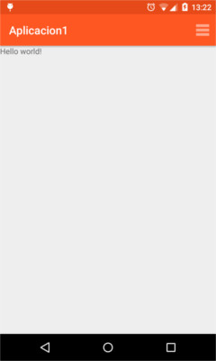
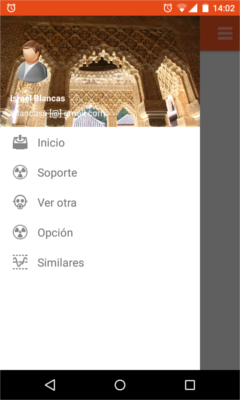

# AndroidExamples
Android Codes

The purpose of this repository is creating a set of templates with "Material Design" elements to make more easy create Android apps.

These codes have been uploaded directly from Android Studio. It is possible you need to make some changes

### Folders

* Aplicacion1: Add a toolbar using Material Design (and App Compat)
* Aplicacion2: Add a navigation drawer (using the previous code)
* Aplicacion3: Creating a service

####Aplicacion1

####Aplicacion2

# Important links:

I have writen this code using some tutorials.

* http://developer.android.com/
* http://www.android4devs.com/
* https://blog.danielbetts.net
* http://www.androidhive.info/
* http://android-developers.blogspot.com.es/
